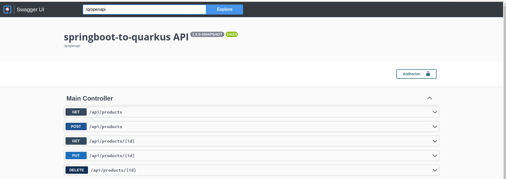

# Migration SpringBoot to Quarkus Cloud Native
This source demonstrates the differences between a Spring Boot application and the same application migrated to Quarkus, running in a native cloud environment. The 'master' branch contains the original application, which was forked from the "https://github.com/CGumera/spring-crud". In the 'quarkus' branch, the code was modified to run using Quarkus in a cloud-native environment. To facilitate comparison, a Containerfile was added to the 'master' branch to simulate conditions similar to the 'Quarkus' branch. However, the original application itself remains unmodified.


## Requirements
* [OpenJDK 1.8 for Spring-Boot branch] (master) (https://developers.redhat.com/content-gateway/file/openjdk/July_2023/java-1.8.0-openjdk-portable-1.8.0.382.b05-2.portable.jdk.el.x86_64.tar.xz)
* OpenJDK 17 for Quarkus branch (quarkus) (https://developers.redhat.com/content-gateway/file/openjdk/17.0.8/java-17-openjdk-17.0.8.0.7-1.portable.jdk.el.x86_64.tar.xz)
* Podman (https://podman.io/docs/installation)
* Apache Maven (https://maven.apache.org/download.cgi)

Other versions of Red Hat OpenJDK Build are available at https://developers.redhat.com/products/openjdk/download#assembly-field-downloads-page-content-82031. Please note that all versions of this tutorial have been implemented and tested on Fedora Linux. Before downloading and installing the requirements, kindly verify your operating system version for compatibility.

## Compiling and running branch master (spring boot)

Before starting the compilation process, let's verify that we have met all the requirements:

1. *Java Development Kit (JDK):* Ensure that you have the required JDK version installed on your system. If you're compiling a Spring Boot application, you'll typically need JDK 8. You can check your JDK version by running the following command in the terminal or command prompt:

```shell
$ java -version
```

```console
openjdk version "1.8.0_382"
OpenJDK Runtime Environment (build 1.8.0_382-b05)
OpenJDK 64-Bit Server VM (build 25.382-b05, mixed mode)
```

2. *Build Tool:* If you're using a specific build tool like Maven, ensure it is installed and available in your system's PATH. You can verify the installation by running the following commands:

```shell
$ mvn -version
```

```console
Apache Maven 3.8.6 (Red Hat 3.8.6-4)
Maven home: /usr/share/maven
Java version: 17.0.7, vendor: Red Hat, Inc., runtime: /usr/lib/jvm/java-17-openjdk-17.0.7.0.7-5.fc38.x86_64
Default locale: en_US, platform encoding: UTF-8
OS name: "linux", version: "6.4.7-200.fc38.x86_64", arch: "amd64", family: "unix"
```

3. *Container Tool:* To validate if Podman is available on your system, you can run the following command in your terminal or command prompt:
```shell
$ podman --version
```

```console
podman version 4.6.0
```

### Build the project:

Open a terminal or command prompt and navigate to the root folder of your Spring Boot project.
Use a build tool Maven to compile the application and package it into an executable WAR file.
For Maven, use the following command:

```shell
$ /mvnw clean package
```

```console
Omitted
[INFO] ------------------------------------------------------------------------
[INFO] BUILD SUCCESS
[INFO] ------------------------------------------------------------------------
[INFO] Total time: 1.536 s
[INFO] Finished at: 2023-08-07T15:43:58-03:00
[INFO] ------------------------------------------------------------------------
```

### Build the container image
To build a container image using Podman, you can follow this step:

```shell
$ podman build -f src/main/container/Containerfile -t app-spring .
```

```console
STEP 1/8: FROM registry.access.redhat.com/ubi8/openjdk-8:1.16-1.1687182685
STEP 2/8: USER root
--> Using cache d35f2ec623d1ffedb127f3faff9416afe34dfd439831345263a6d7dcd8f9fb84
--> d35f2ec623d1
STEP 3/8: WORKDIR /work/
--> Using cache 54f9b9de434df8744d31fc11b84258249473dbb21b1512a0cff5b2381a691b5b
--> 54f9b9de434d
STEP 4/8: RUN chown 1001 /work     && chmod "g+rwX" /work     && chown 1001:root /work
--> Using cache ee45d3ceae1acd5144e3f02621feb35beb6d34f5fe2167305ed1a66ea5e1399f
--> ee45d3ceae1a
STEP 5/8: COPY --chown=1001:root target/*.jar /work
--> Using cache 94318ae4545747a865d02107dd438701279df61abf8e5bf1f224bf0335245d9d
--> 94318ae45457
STEP 6/8: EXPOSE 8888
--> Using cache 52742bb081b8d6f5695df741cc05c3dece71a136677eec99ef0a219142f6dd15
--> 52742bb081b8
STEP 7/8: USER 1001
--> Using cache 5b580982b1a13265c885f367cb9a75a63f435d88999fad5dc7bf799b4dfc0305
--> 5b580982b1a1
STEP 8/8: CMD ["java", "-jar", "crud-1.0.0.jar"]
--> Using cache 8a25459762435e061c8160f2c16a4f0f0159370f480f956d7e5bd3720f11969c
COMMIT app-spring
--> 8a2545976243
Successfully tagged localhost/app-spring:latest
8a25459762435e061c8160f2c16a4f0f0159370f480f956d7e5bd3720f11969c
```
### Running your application in a container
To run your application in a container using Podman, follow this step:

```shell
$ podman run -i --rm -p 8888:8888 app-spring
```

```console

  .   ____          _            __ _ _
 /\\ / ___'_ __ _ _(_)_ __  __ _ \ \ \ \
( ( )\___ | '_ | '_| | '_ \/ _` | \ \ \ \
 \\/  ___)| |_)| | | | | || (_| |  ) ) ) )
  '  |____| .__|_| |_|_| |_\__, | / / / /
 =========|_|==============|___/=/_/_/_/
 :: Spring Boot ::        (v2.0.4.RELEASE)

2023-08-07 18:51:48.140  INFO 1 --- [           main] com.englishcentral.crud.CrudApplication  : Starting CrudApplication v1.0.0 on 07d233b5c256 with PID 1 (/work/crud-1.0.0.jar started by 1001 in /work)
2023-08-07 18:51:48.142  INFO 1 --- [           main] com.englishcentral.crud.CrudApplication  : No active profile set, falling back to default profiles: default
2023-08-07 18:51:48.173  INFO 1 --- [           main] ConfigServletWebServerApplicationContext : Refreshing org.springframework.boot.web.servlet.context.AnnotationConfigServletWebServerApplicationContext@3cd1f1c8: startup date [Mon Aug 07 18:51:48 GMT 2023]; root of context hierarchy
2023-08-07 18:51:48.967  INFO 1 --- [           main] trationDelegate$BeanPostProcessorChecker : Bean 'org.springframework.transaction.annotation.ProxyTransactionManagementConfiguration' of type [org.springframework.transaction.annotation.ProxyTransactionManagementConfiguration$$EnhancerBySpringCGLIB$$dfa59b] is not eligible for getting processed by all BeanPostProcessors (for example: not eligible for auto-proxying)
2023-08-07 18:51:49.269  INFO 1 --- [           main] o.s.b.w.embedded.tomcat.TomcatWebServer  : Tomcat initialized with port(s): 8888 (http)
2023-08-07 18:51:49.289  INFO 1 --- [           main] o.apache.catalina.core.StandardService   : Starting service [Tomcat]
2023-08-07 18:51:49.289  INFO 1 --- [           main] org.apache.catalina.core.StandardEngine  : Starting Servlet Engine: Apache Tomcat/8.5.32
2023-08-07 18:51:49.297  INFO 1 --- [ost-startStop-1] o.a.catalina.core.AprLifecycleListener   : The APR based Apache Tomcat Native library which allows optimal performance in production environments was not found on the java.library.path: [/usr/java/packages/lib/amd64:/usr/lib64:/lib64:/lib:/usr/lib]
2023-08-07 18:51:49.380  INFO 1 --- [ost-startStop-1] o.a.c.c.C.[Tomcat].[localhost].[/]       : Initializing Spring embedded WebApplicationContext
2023-08-07 18:51:49.380  INFO 1 --- [ost-startStop-1] o.s.web.context.ContextLoader            : Root WebApplicationContext: initialization completed in 1209 ms
2023-08-07 18:51:49.442  INFO 1 --- [ost-startStop-1] o.s.b.w.servlet.ServletRegistrationBean  : Servlet dispatcherServlet mapped to [/]
2023-08-07 18:51:49.443  INFO 1 --- [ost-startStop-1] o.s.b.w.servlet.ServletRegistrationBean  : Servlet webServlet mapped to [/h2-console/*]
2023-08-07 18:51:49.445  INFO 1 --- [ost-startStop-1] o.s.b.w.servlet.FilterRegistrationBean   : Mapping filter: 'characterEncodingFilter' to: [/*]
2023-08-07 18:51:49.445  INFO 1 --- [ost-startStop-1] o.s.b.w.servlet.FilterRegistrationBean   : Mapping filter: 'hiddenHttpMethodFilter' to: [/*]
2023-08-07 18:51:49.446  INFO 1 --- [ost-startStop-1] o.s.b.w.servlet.FilterRegistrationBean   : Mapping filter: 'httpPutFormContentFilter' to: [/*]
2023-08-07 18:51:49.446  INFO 1 --- [ost-startStop-1] o.s.b.w.servlet.FilterRegistrationBean   : Mapping filter: 'requestContextFilter' to: [/*]
2023-08-07 18:51:49.542  INFO 1 --- [           main] com.zaxxer.hikari.HikariDataSource       : HikariPool-1 - Starting...
2023-08-07 18:51:49.654  INFO 1 --- [           main] com.zaxxer.hikari.HikariDataSource       : HikariPool-1 - Start completed.
2023-08-07 18:51:49.689  INFO 1 --- [           main] j.LocalContainerEntityManagerFactoryBean : Building JPA container EntityManagerFactory for persistence unit 'default'
2023-08-07 18:51:49.700  INFO 1 --- [           main] o.hibernate.jpa.internal.util.LogHelper  : HHH000204: Processing PersistenceUnitInfo [
	name: default
	...]
2023-08-07 18:51:49.752  INFO 1 --- [           main] org.hibernate.Version                    : HHH000412: Hibernate Core {5.2.17.Final}
2023-08-07 18:51:49.752  INFO 1 --- [           main] org.hibernate.cfg.Environment            : HHH000206: hibernate.properties not found
2023-08-07 18:51:49.778  INFO 1 --- [           main] o.hibernate.annotations.common.Version   : HCANN000001: Hibernate Commons Annotations {5.0.1.Final}
2023-08-07 18:51:49.903  INFO 1 --- [           main] org.hibernate.dialect.Dialect            : HHH000400: Using dialect: org.hibernate.dialect.H2Dialect
2023-08-07 18:51:50.205  INFO 1 --- [           main] o.h.t.schema.internal.SchemaCreatorImpl  : HHH000476: Executing import script 'org.hibernate.tool.schema.internal.exec.ScriptSourceInputNonExistentImpl@52f27fbd'
2023-08-07 18:51:50.207  INFO 1 --- [           main] j.LocalContainerEntityManagerFactoryBean : Initialized JPA EntityManagerFactory for persistence unit 'default'
2023-08-07 18:51:50.594  WARN 1 --- [           main] aWebConfiguration$JpaWebMvcConfiguration : spring.jpa.open-in-view is enabled by default. Therefore, database queries may be performed during view rendering. Explicitly configure spring.jpa.open-in-view to disable this warning
2023-08-07 18:51:50.650  INFO 1 --- [           main] s.w.s.m.m.a.RequestMappingHandlerMapping : Mapped "{[/api/products],methods=[GET]}" onto public java.util.List<com.englishcentral.crud.model.Product> com.englishcentral.crud.controller.MainController.getProducts()
2023-08-07 18:51:50.650  INFO 1 --- [           main] s.w.s.m.m.a.RequestMappingHandlerMapping : Mapped "{[/api/products/{id}],methods=[GET]}" onto public com.englishcentral.crud.model.Product com.englishcentral.crud.controller.MainController.getProduct(java.lang.Long)
2023-08-07 18:51:50.651  INFO 1 --- [           main] s.w.s.m.m.a.RequestMappingHandlerMapping : Mapped "{[/api/products],methods=[POST]}" onto public org.springframework.http.ResponseEntity com.englishcentral.crud.controller.MainController.createProduct(com.englishcentral.crud.payload.ProductRequest)
2023-08-07 18:51:50.651  INFO 1 --- [           main] s.w.s.m.m.a.RequestMappingHandlerMapping : Mapped "{[/api/products/{id}],methods=[PUT]}" onto public org.springframework.http.ResponseEntity com.englishcentral.crud.controller.MainController.updateProduct(com.englishcentral.crud.payload.ProductRequest,java.lang.Long)
2023-08-07 18:51:50.651  INFO 1 --- [           main] s.w.s.m.m.a.RequestMappingHandlerMapping : Mapped "{[/api/products/{id}],methods=[DELETE]}" onto public org.springframework.http.ResponseEntity com.englishcentral.crud.controller.MainController.deleteProduct(java.lang.Long)
2023-08-07 18:51:50.653  INFO 1 --- [           main] s.w.s.m.m.a.RequestMappingHandlerMapping : Mapped "{[/swagger-resources]}" onto public org.springframework.http.ResponseEntity<java.util.List<springfox.documentation.swagger.web.SwaggerResource>> springfox.documentation.swagger.web.ApiResourceController.swaggerResources()
2023-08-07 18:51:50.653  INFO 1 --- [           main] s.w.s.m.m.a.RequestMappingHandlerMapping : Mapped "{[/swagger-resources/configuration/ui]}" onto public org.springframework.http.ResponseEntity<springfox.documentation.swagger.web.UiConfiguration> springfox.documentation.swagger.web.ApiResourceController.uiConfiguration()
2023-08-07 18:51:50.653  INFO 1 --- [           main] s.w.s.m.m.a.RequestMappingHandlerMapping : Mapped "{[/swagger-resources/configuration/security]}" onto public org.springframework.http.ResponseEntity<springfox.documentation.swagger.web.SecurityConfiguration> springfox.documentation.swagger.web.ApiResourceController.securityConfiguration()
2023-08-07 18:51:50.655  INFO 1 --- [           main] s.w.s.m.m.a.RequestMappingHandlerMapping : Mapped "{[/error],produces=[text/html]}" onto public org.springframework.web.servlet.ModelAndView org.springframework.boot.autoconfigure.web.servlet.error.BasicErrorController.errorHtml(javax.servlet.http.HttpServletRequest,javax.servlet.http.HttpServletResponse)
2023-08-07 18:51:50.656  INFO 1 --- [           main] s.w.s.m.m.a.RequestMappingHandlerMapping : Mapped "{[/error]}" onto public org.springframework.http.ResponseEntity<java.util.Map<java.lang.String, java.lang.Object>> org.springframework.boot.autoconfigure.web.servlet.error.BasicErrorController.error(javax.servlet.http.HttpServletRequest)
2023-08-07 18:51:50.745  INFO 1 --- [           main] pertySourcedRequestMappingHandlerMapping : Mapped URL path [/v2/api-docs] onto method [public org.springframework.http.ResponseEntity<springfox.documentation.spring.web.json.Json> springfox.documentation.swagger2.web.Swagger2Controller.getDocumentation(java.lang.String,javax.servlet.http.HttpServletRequest)]
2023-08-07 18:51:50.797  INFO 1 --- [           main] o.s.w.s.handler.SimpleUrlHandlerMapping  : Mapped URL path [/**/favicon.ico] onto handler of type [class org.springframework.web.servlet.resource.ResourceHttpRequestHandler]
2023-08-07 18:51:50.900  INFO 1 --- [           main] s.w.s.m.m.a.RequestMappingHandlerAdapter : Looking for @ControllerAdvice: org.springframework.boot.web.servlet.context.AnnotationConfigServletWebServerApplicationContext@3cd1f1c8: startup date [Mon Aug 07 18:51:48 GMT 2023]; root of context hierarchy
2023-08-07 18:51:50.938  INFO 1 --- [           main] o.s.w.s.handler.SimpleUrlHandlerMapping  : Mapped URL path [/webjars/**] onto handler of type [class org.springframework.web.servlet.resource.ResourceHttpRequestHandler]
2023-08-07 18:51:50.938  INFO 1 --- [           main] o.s.w.s.handler.SimpleUrlHandlerMapping  : Mapped URL path [/**] onto handler of type [class org.springframework.web.servlet.resource.ResourceHttpRequestHandler]
2023-08-07 18:51:51.120  INFO 1 --- [           main] o.s.j.e.a.AnnotationMBeanExporter        : Registering beans for JMX exposure on startup
2023-08-07 18:51:51.122  INFO 1 --- [           main] o.s.j.e.a.AnnotationMBeanExporter        : Bean with name 'dataSource' has been autodetected for JMX exposure
2023-08-07 18:51:51.126  INFO 1 --- [           main] o.s.j.e.a.AnnotationMBeanExporter        : Located MBean 'dataSource': registering with JMX server as MBean [com.zaxxer.hikari:name=dataSource,type=HikariDataSource]
2023-08-07 18:51:51.130  INFO 1 --- [           main] o.s.c.support.DefaultLifecycleProcessor  : Starting beans in phase 2147483647
2023-08-07 18:51:51.131  INFO 1 --- [           main] d.s.w.p.DocumentationPluginsBootstrapper : Context refreshed
2023-08-07 18:51:51.149  INFO 1 --- [           main] d.s.w.p.DocumentationPluginsBootstrapper : Found 1 custom documentation plugin(s)
2023-08-07 18:51:51.183  INFO 1 --- [           main] s.d.s.w.s.ApiListingReferenceScanner     : Scanning for api listing references
2023-08-07 18:51:51.321  INFO 1 --- [           main] o.s.b.w.embedded.tomcat.TomcatWebServer  : Tomcat started on port(s): 8888 (http) with context path ''
2023-08-07 18:51:51.324  INFO 1 --- [           main] com.englishcentral.crud.CrudApplication  : Started CrudApplication in 3.406 seconds (JVM running for 3.727)
```

### Using the Application:
Use Swagger UI to test the endpoints. URL = http://localhost:8888/swagger-ui.html#/


## Compiling and running branch quarkus
*Java Development Kit (JDK):* Ensure that you have the required JDK version installed on your system. If you're compiling a Spring Boot application, you'll typically need JDK 17. You can check your JDK version by running the following command in the terminal or command prompt:

```shell
$ java -version
```

```console
openjdk version "17.0.8" 2023-07-18 LTS
OpenJDK Runtime Environment (Red_Hat-17.0.8.0.7-1.el7openjdkportable) (build 17.0.8+7-LTS)
OpenJDK 64-Bit Server VM (Red_Hat-17.0.8.0.7-1.el7openjdkportable) (build 17.0.8+7-LTS, mixed mode, sharing)
```

* Changing do branch quarkus

```shell
$ git checkout quarkus
```

```console
branch 'quarkus' set up to track 'origin/quarkus'.
Switched to a new branch 'quarkus'
```

### Build the project:

Open a terminal or command prompt and navigate to the root folder of your Spring Boot project.
Use a build tool Maven to compile the application and package it into an executable WAR file.
For Maven, use the following command:

```shell
$ mvn clean package -Pnative
```

```console
Omitted
[INFO] ------------------------------------------------------------------------
[INFO] BUILD SUCCESS
[INFO] ------------------------------------------------------------------------
[INFO] Total time:  02:55 min
[INFO] Finished at: 2023-08-07T16:13:34-03:00
[INFO] ------------------------------------------------------------------------
```

### Build the container image
To build a container image using Podman, you can follow this step:

```shell
$ podman build -f src/main/container/Containerfile -t app-quarkus .
```

```console
STEP 1/7: FROM registry.access.redhat.com/ubi8/ubi-minimal:8.6
Trying to pull registry.access.redhat.com/ubi8/ubi-minimal:8.6...
Getting image source signatures
Checking if image destination supports signatures
Copying blob a6577091999b done  
Copying config abb1ba1bce done  
Writing manifest to image destination
Storing signatures
STEP 2/7: WORKDIR /work/
--> df35841fb672
STEP 3/7: RUN chown 1001 /work     && chmod "g+rwX" /work     && chown 1001:root /work
--> c9cb5c1d12e4
STEP 4/7: COPY --chown=1001:root target/*-runner /work/application
--> af61447d8866
STEP 5/7: EXPOSE 8080
--> 1e5a7448a8ad
STEP 6/7: USER 1001
--> 6f5b2f49201f
STEP 7/7: CMD ["./application", "-Dquarkus.http.host=0.0.0.0"]
COMMIT app-quarkus
--> 35056b448588
Successfully tagged localhost/app-quarkus:latest
35056b448588337f634bd64b494f5ee50940a032455799c2626ca395f441e383
```

### Running your application in a container
To run your application in a container using Podman, follow this step:

```shell
$ podman run -i --rm -p 8080:8080 app-quarkus
```

```console
__  ____  __  _____   ___  __ ____  ______ 
 --/ __ \/ / / / _ | / _ \/ //_/ / / / __/ 
 -/ /_/ / /_/ / __ |/ , _/ ,< / /_/ /\ \   
--\___\_\____/_/ |_/_/|_/_/|_|\____/___/   
2023-08-07 19:38:26,566 INFO  [io.quarkus] (main) springboot-to-quarkus 1.0.0-SNAPSHOT native (powered by Quarkus 3.1.2.Final) started in 0.030s. Listening on: http://0.0.0.0:8080
2023-08-07 19:38:26,566 INFO  [io.quarkus] (main) Profile prod activated. 
2023-08-07 19:38:26,566 INFO  [io.quarkus] (main) Installed features: [agroal, cdi, hibernate-orm, hibernate-orm-panache, hibernate-validator, jdbc-h2, narayana-jta, resteasy-reactive, resteasy-reactive-jackson, smallrye-context-propagation, smallrye-openapi, spring-boot-properties, spring-data-jpa, spring-di, spring-web, swagger-ui, vertx]

```

### Using the Application:
Use Swagger UI to test the endpoints. URL = http://localhost:8080/q/swagger-ui



## Comparation Quarkus versus Spring-Boot

Several essential questions must be addressed before proceeding with the decision to migrate your Spring Boot application to Quarkus in its native form.

* **Do the legacy Spring libraries have a compatible implementation in quarkus for cloud native?**
*If your application meets the necessary criteria, migrating to Quarkus or Quarkus + GraalVM might be a wise decision. However, there are certain aspects to consider. While native applications offer fast startup times, their performance may diminish compared to GraalVM when running for prolonged periods. Additionally, the cost of migration and code rewriting must be taken into account. In this context, the example utilized involved a straightforward application with cloud-native libraries compatible with Quarkus.*


